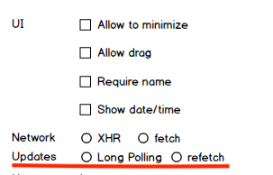

# Long polling

Добавить в конфигуратор опцию, которая будет задавать, какой механизм использовать для получения новых сообщений.

`refetch` - использовать периодические запросы на сервер с выбранной выше технологией (fetch/XHR)

`long polling` - использовать одно подключение для подписки на изменения в БД

Для интерфейса оператора всегда использовать `long polling`.

Для этого нужно выделить модуль загрузки сообщений, определить для него интерфейс и сделать две реализации на соотвествующих технологиях.
