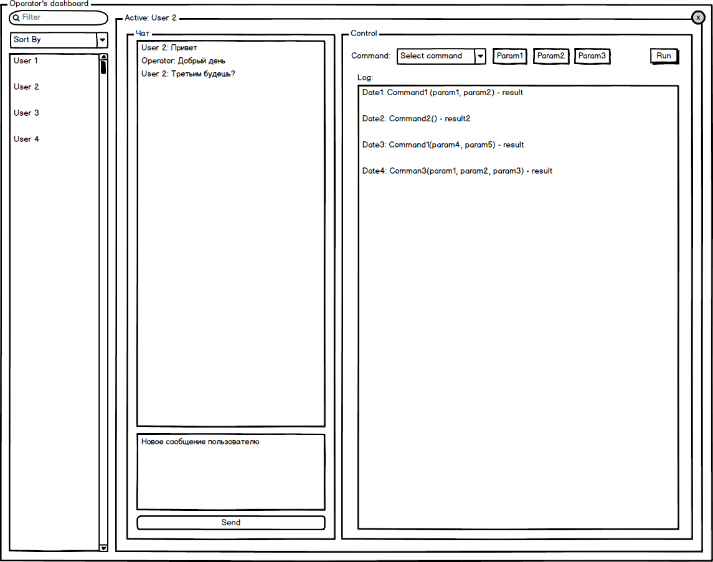

# Commands

## Введение

В функционале чата появляется новая сущность - `команда`.

В общем случае - `команда` - это функция которая (вместе с параметрами) задается на стороне оператора, выполняется на стороне клиента чата, а результат отображается у оператора инициировавшего команду.

Самый общий вариант команды - реальная функция, которая отправляется оператором в виде специально сформированного сообщения. Которое обрабатывается клиентом на исполнение, и не показывается в истории чата. Результат работы функции ( или факт, что задача выполнена ) отображается в логе оператора.

Подход с отправкой js-кода и выполнением его на клиенте чреват проблемами безопасности. Поэтому разумным компромисом будет определение возможных действий заранее, и дальше отправлять не код, а имя из заранее определенного списка, с параметрами вызываемому методу.

## Задача

В интерфейсе оператора, при выборе пользователя, появляется новый блок, для выполнения команд.

Блок содержит форму выбора команды, ввод параметров для команды (до 2х) при необходимости и кнопку запуска задачи.

Ниже находится блок с отображением лога выполненных команд, который отображает выполненные (или запущенные) команды и их результат, после выполнения.

Необходимо реализовать минимум две команды (все команды асинхронные):

- получение информации о пользователе с помощью одно из сервисов (тип сервиса - параметр команды). Результат - данные от сервиса, загруженные на стороне клиента.

  - https://ipinfo.io/
  - http://ip-api.com/
  - https://geoip-db.com/

- запрос у пользователя информации через модальное окно (не `prompt`) - параметрами команды являются заголовок окна, текст сообщения, значение `placeholder` для поля ввода. Результат - текст, введенный пользователем.

## Замечания

- Команды не должны отображаться у пользователя в чате
- Команды должны выполнятся только один раз (не должно быть повторного выполнения команд при обновлении клиентом страницы)
- история команд должна храниться и быть доступной для оператора
